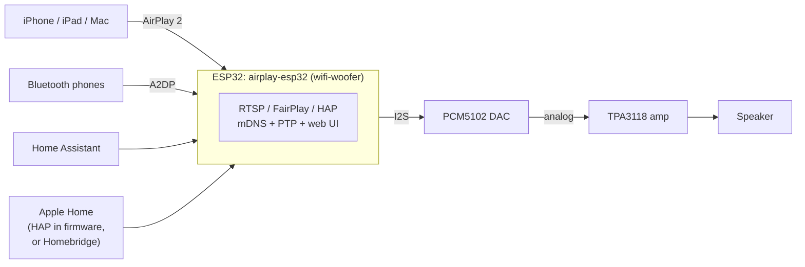

# Architecture

> **2026-10-06 pivot:** the original plan was a custom AirPlay 1 (RAOP)
> receiver. We adopted **[airplay-esp32](https://github.com/rbouteiller/airplay-esp32)**
> instead (cloned at `firmware-airplay2/`), which provides full **AirPlay 2** on
> our classic ESP32. This doc describes the current architecture; the old
> custom-RAOP firmware is preserved under `attic/custom-raop-firmware/` and the
> old integration notes in [raop-integration.md](raop-integration.md) (superseded).

## Overview

## Firmware stack

Base: **airplay-esp32** (ESP-IDF v5.5 via PlatformIO). Layers we use as-is:

- **RTSP/FairPlay server + AirPlay 2 pairing** (`main/rtsp/`) — what makes the
  speaker appear natively in Control Center with multi-room PTP sync.
- **Audio pipeline** (`main/audio/`): buffered AAC (AirPlay 2) and realtime
  ALAC (AirPlay 1) streams → decoders → jitter buffer → I2S output.
- **HomeKit Accessory Protocol** (`main/hap/`) — the speaker can pair directly
  into Apple Home (HAP), no Homebridge strictly required.
- **Network stack** (`main/network/`): WiFi AP+STA with captive-portal setup,
  mDNS advertisement, PTP clock, web config server, OTA updates.
- **Bluetooth A2DP sink** — bonus input available only on classic ESP32.

Our additions (board-specific configuration, no code changes):

- `config/sdkconfig.user.elegoo-wroom` — generic-ESP32 board, **PSRAM off**
  (base defaults enable it; WROOM-32 has none), 4 MB OTA partition table,
  I2S pins BCK=26 / WS=25 / DO=22, PCM5102 XSMT mute GPIO 21 (active high).
- `user_platformio.ini` — the `elegoo-wroom` environment extending
  `esp32wrover-dev` (the classic-ESP32 4 MB dev-board base).

## Resource reality (classic ESP32, no PSRAM)

- 520 KB internal RAM total; base defaults push big allocations to SPIRAM, so
  the no-PSRAM override concentrates everything in internal DRAM. The upstream
  project documents classic-ESP32 support, but this is its most constrained
  supported target — verify actual runtime margins on hardware.
- 4 MB flash with the `partitions-4m.csv` OTA layout: measured 90.3% of the
  ~1.9 MB app slot (1,776,223 B) and a passing SPIFFS image build after
  removing the unused `data/bg/` display background. Flash is the binding
  constraint — OTA updates will have little slack.

## Integrations

- **Home Assistant**: discovers the speaker via its AirPlay/mDNS advertisement
  as a `media_player` (play/pause, volume, metadata). Zero extra config.
- **Apple Home**: two options — (a) native HAP pairing built into the firmware
  (preferred; try first), or (b) the existing Homebridge as fallback.
- **Google Cast**: dropped (proprietary protocol, no viable ESP32 receiver).

## Key decisions

- **Adopted airplay-esp32** (2026-10-06) over a custom RAOP stack: full
  AirPlay 2, matches our exact hardware reference build (ESP32 + PCM5102A),
  active project. Tradeoffs accepted: **non-commercial license**, PlatformIO
  workflow, and protocol-breakage risk on future iOS updates.
- **PCM5102 → analog TPA3118**: the amp is analog-input only; volume is
  controlled digitally in the I2S/audio pipeline, mute via GPIO 21 → XSMT.
- **ESP-IDF v5.5 / PlatformIO** per upstream; build env `elegoo-wroom`.
