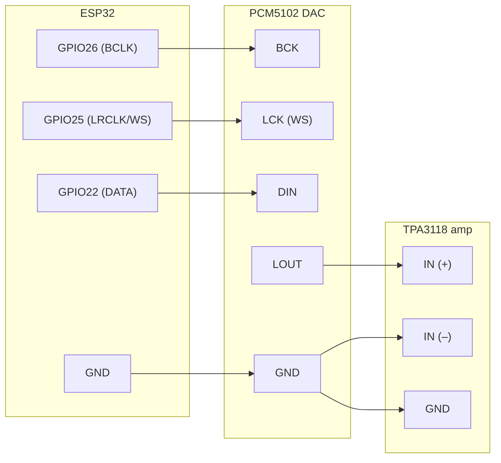
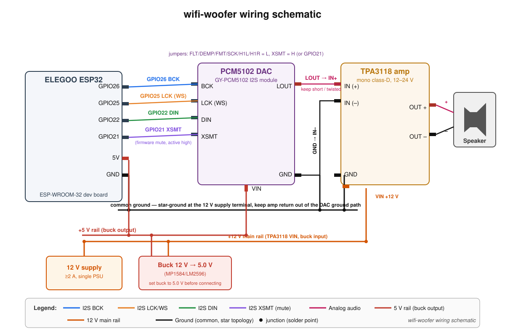
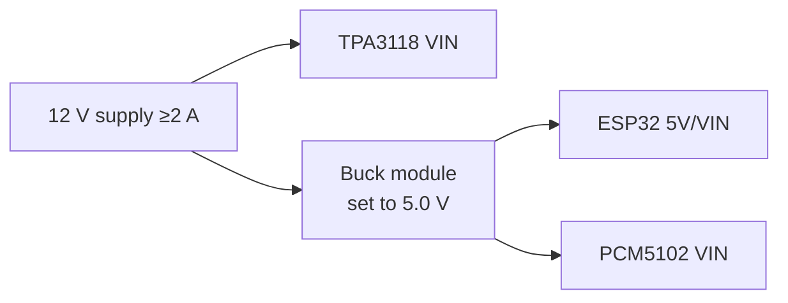

# Hardware & Wiring

## Parts

| Part | Notes |
|---|---|
| ELEGOO ESP32 dev board | ESP-WROOM-32, USB-C, 4 MB flash, no PSRAM |
| PCM5102 I2S DAC module | Purple/breakout board, "PCM5102 GY-PCM5102 I2S" |
| TPA3118 mono amp | Amazon B07Q6RGVHQ, analog line-in, 3 W–60 W class-D mono |
| Speaker | Matched to TPA3118 supply voltage & load |
| **12 V ≥2 A single supply** | Powers the whole speaker (amp directly, logic via buck) |
| MP1584/LM2596 buck module | 12 V → 5.0 V for ESP32 + PCM5102 (~$2; set voltage with a multimeter before connecting anything) |
| Optional: USB-C breakout | If the ELEGOO board has no 5V/VIN pin, feed the buck's 5 V into a USB-C breakout's VBUS |

## Signal path

The SVG above is the authoritative wiring reference; the Mermaid diagram is
only the logical overview.

### PCM5102 module settings (solder jumpers on the back)

| Jumper | Set to | Why |
|---|---|---|
| H1L / H1R | **L** | Leave 3.3 V I2S levels, no external pull-ups needed |
| FLT | **L** (filter: normal / I2S) | Standard I2S mode |
| DEMP | **L** | No de-emphasis |
| XSMT | **H** (or wire to an ESP32 GPIO) | Un-mute; wiring to a GPIO lets firmware mute the DAC |
| FMT  | **L** | I2S format |
| SCK  | **L** | DAC generates its own system clock from BCK (44.1 kHz family) |

### TPA3118 board

- Input: the board's analog input, wire LOUT → IN+, board GND → IN–. Keep this
  wire short and shielded/twisted if possible.
- Power: per board variant, 4.5 V–24 V DC. Higher voltage = more power into the
  speaker. We run the board at **12 V** (single-supply design).
- Gain: set by the gain resistor on the board; default 26 dB–36 dB range — start
  low and raise volume in firmware first.

## Power (single 12 V supply)

One 12 V ≥2 A supply powers everything:

- **Set the buck output to 5.0 V with a multimeter before connecting the
  ESP32 or DAC** — an MP1584 module shipped at its default setting can output
  far too much.
- Keep the buck module physically separated (≥2 cm) from the PCM5102; its
  switching frequency sits near the audio band's sampling artifacts.
- Star-ground at the PSU terminal: the amp's high-current ground return must
  not route through the DAC's ground path, or you get hum.
- Common ground between all boards is required.
- If a faint whine that tracks volume ever appears, add 470 µF–1000 µF
  electrolytic + 0.1 µF ceramic across the 5 V rail at the DAC end.

## Bring-up order

1. Flash the test-tone firmware, verify 1 kHz sine at the PCM5102 LOUT with a
   scope or headphones — before connecting the amp.
2. Connect the amp at low gain, speaker attached, volume 10 %.
3. Then move on to WiFi + RAOP.
