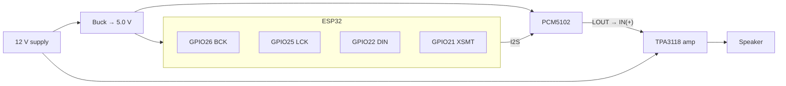

# Build Your Own wifi-woofer: A Complete Tutorial

This tutorial walks you through building a WiFi speaker that shows up as an
**AirPlay 2** speaker on any iPhone, iPad, or Mac — with multi-room sync,
Bluetooth input, and a web configuration UI — for roughly $25 in parts and no
soldering beyond screw terminals and header pins.

Total time: about 2–3 hours, most of it waiting for a firmware build.

> **What you're building:** an ESP32 receives audio over WiFi (AirPlay 2 /
> Bluetooth), decodes it, and streams it over I2S to a PCM5102 DAC, whose analog
> output feeds a TPA3118 amplifier and speaker. One 12 V power supply runs
> everything. Full design rationale lives in [architecture.md](architecture.md);
> this page is the step-by-step path.

---

## Step 0 — What you need

| Part | Approx. cost | Notes |
|---|---|---|
| ESP32 dev board, **ESP-WROOM-32** (e.g. ELEGOO, USB-C) | $10 | Any classic-ESP32 board works; this tutorial assumes 4 MB flash, no PSRAM |
| PCM5102 I2S DAC module | $8 | The common purple "GY-PCM5102" breakout; often sold in 2–3 packs |
| TPA3118 mono amp board | $8 | Analog line-in class-D (e.g. Amazon B07Q6RGVHQ) |
| Speaker (4 Ω or 8 Ω) | — | Sized to your amp supply and room |
| **12 V DC supply, ≥2 A** | $8 | One supply runs everything |
| MP1584 ("mini-360") or LM2596 buck module | $2 | Steps 12 V down to 5 V for the logic |
| USB-C breakout with VBUS/GND exposed | $2 | Only if your board has no 5V/VIN pin |
| Dupont jumper wires, micro-USB/USB-C cable | — | |

Software: [PlatformIO Core](https://docs.platformio.org/en/latest/core/index.html)
(`pip install platformio`) on any Linux/macOS/Windows machine. PlatformIO
downloads the ESP-IDF 5.5 toolchain automatically on first build (~1 GB).

---

## Step 1 — Configure the DAC module

The PCM5102 breakout has solder-jumper pads on its back. Set them **before
wiring**:

| Pad | Setting | Why |
|---|---|---|
| FLT | L | Standard I2S filter mode |
| DEMP | L | No de-emphasis |
| XSMT | wire to ESP32 **GPIO21** (alternative: H) | Lets firmware mute the DAC |
| FMT | L | I2S format |
| SCK | L | DAC derives its system clock from BCK |
| H1L / H1R | per silkscreen | 3.3 V I2S levels |

## Step 2 — Set the buck converter

**Before connecting anything to the buck's output**, power it from the 12 V
supply and adjust its potentiometer until a multimeter reads **5.0 V**.
MP1584 modules ship at arbitrary voltages; connecting an unadjusted one to your
ESP32 can kill it.

## Step 3 — Wire it up

Authoritative reference: [the schematic](schematic.svg). Summary:



Wiring rules that matter:

- **I2S**: GPIO26→BCK, GPIO25→LCK (WS), GPIO22→DIN, GPIO21→XSMT.
- **Analog**: PCM5102 LOUT → TPA3118 IN(+), DAC GND → IN(–). Keep this wire
  short and twisted/shielded.
- **Power**: 12 V goes directly to the TPA3118 VIN; the buck's 5.0 V output
  feeds the ESP32 5V/VIN pin (or a USB-C breakout's VBUS) and the PCM5102 VIN.
- **Ground**: everything shares one ground, star-connected at the 12 V
  supply's terminal. The amp's ground return must not flow through the DAC's
  ground path, or you will get hum.
- Keep the buck module ≥2 cm away from the PCM5102 to avoid switching noise.

## Step 4 — Build and flash the firmware

```bash
git clone https://github.com/harrisonoest/wifi-woofer.git
cd wifi-woofer/firmware-airplay2
pip install platformio        # if you don't have it

pio run -e elegoo-wroom            # build firmware (~2 min first time)
pio run -e elegoo-wroom -t upload  # flash via USB
pio run -e elegoo-wroom -t uploadfs  # flash the web UI — REQUIRED
```

The `elegoo-wroom` environment (defined in `user_platformio.ini` +
`config/sdkconfig.user.elegoo-wroom`) configures the upstream
[airplay-esp32](https://github.com/rbouteiller/airplay-esp32) firmware (v0.2.1)
for this exact hardware: no PSRAM, 4 MB flash with OTA partitions, and the I2S
pins above. If you use different GPIOs or a board with PSRAM, copy those two
files and adjust — upstream's
[custom board guide](https://github.com/rbouteiller/airplay-esp32/blob/main/docs/boards/custom.md)
explains the layering.

Expect RAM ~25 % and flash ~90 % of the OTA app slot on a 4 MB board — flash is
the tight resource here.

Watch the first boot with `pio run -e elegoo-wroom -t monitor`.

## Step 5 — First boot and WiFi setup

1. The speaker creates a setup WiFi network on first boot. Join it from a
   phone/laptop; a captive portal opens (or browse to its gateway IP).
2. Enter your home WiFi credentials. The speaker reboots onto your network as
   **"Wifi Woofer"**.
3. Open its web UI (the IP shows in the serial monitor, or `wifi-woofer.local`)
   to rename it, set volume limits, and check status.

## Step 6 — Play music

- **AirPlay**: on an iPhone/iPad/Mac, open Control Center → Screen Mirroring /
  audio output → pick **Wifi Woofer**. Multi-room grouping works like a HomePod.
- **Bluetooth**: pair from any phone (classic ESP32 only) — Bluetooth
  automatically suspends/resumes AirPlay.
- **Rename**: web UI → device name (this also changes its `hostname.local`).

## Step 7 — Home Assistant and Apple Home

- **Home Assistant**: the speaker is auto-discovered as an AirPlay
  `media_player` — play/pause, volume, and track metadata work with zero
  configuration.
- **Apple Home**: two options. Try the firmware's built-in **HomeKit (HAP)**
  pairing first (add accessory in the Home app); use a
  [Homebridge](https://github.com/homebridge/homebridge) AirPlay plugin as a
  fallback.

## Troubleshooting

| Symptom | Likely cause / fix |
|---|---|
| No sound at all | Buck output voltage; XSMT jumper (must be driven high by GPIO21); amp gain set too low |
| Distorted audio at volume | Amp supply sagging — use a 12 V ≥2 A supply, not a phone charger |
| Faint whine tracking volume | Buck switching noise — add 470 µF + 0.1 µF across 5 V at the DAC end, increase buck–DAC distance |
| Speaker missing from AirPlay list | mDNS blocked on your network (AP/client isolation); check the serial monitor |
| `uploadfs` skipped | The web UI lives in SPIFFS — without it the device boots but has no config portal/web UI |
| Build fails on flash size | Confirm your board is 4 MB (the `elegoo-wroom` env assumes it) |

## Updating firmware

The firmware supports **OTA updates** from its own web UI after the first USB
flash. To update the vendored firmware itself, see [NOTICE.md](../NOTICE.md)
for the upstream pin and the exact local modifications to re-apply.

## License note

The vendored firmware is **non-commercial use only** (upstream license). Fine
for your home; not for selling speakers.
